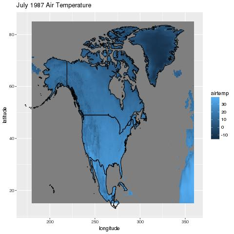
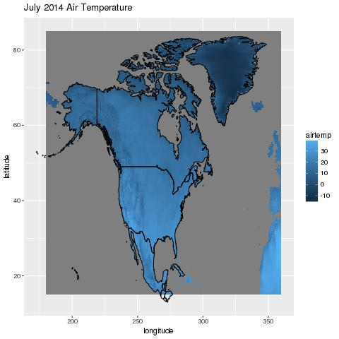
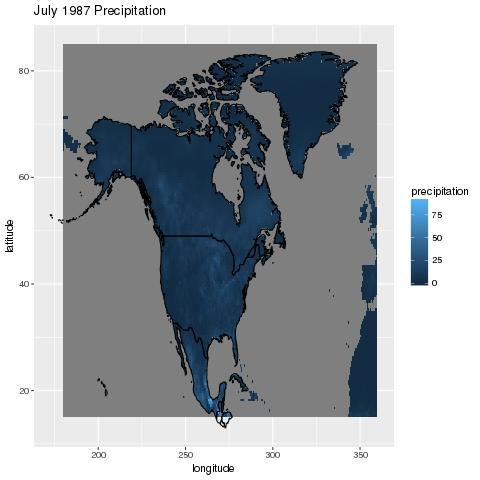

# Climate Report

## North American Temperature and Precipitation, 1960-2014

### Temperature

Considering this data is for the month of July, temperatures throughout North America
should be relatively hot which is shown. The years are almost identical which is also interesting,
but should be accuracte.

### Precipitation

Similar to temperature, percipitation doesn't change much for the differnt times. The percentage is very low
which is normal for the month of July.
